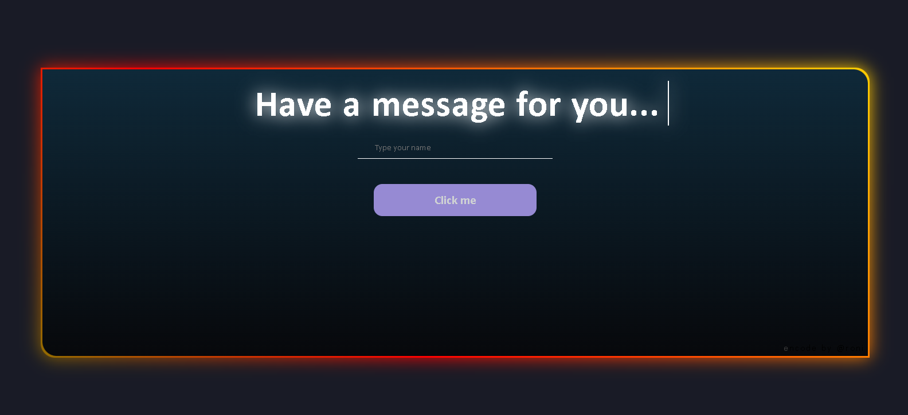

# ✨ WishMe – Personalized Diwali Greetings 🎆

Celebrate Diwali with lights, love, and personalized wishes — all from your browser.

 <!-- Replace with your own image later -->

---

## 🎯 What It Does

💡 This web app:
- Greets users with a customized **Diwali message**
- Allows pressing **Enter** or clicking a button to show the message
- Triggers a beautiful **confetti explosion** for a festive vibe 🎉
- Styled with glowing text, rainbow animations, and a responsive layout

---

## 🌐 Live Demo

📱 View it live (hosted versions):  
- [wish-me-diwali (Netlify)](https://wish-me-diwalii.netlify.app/)
- [wish-me-diwali (GitHub Pages)](https://ronipaul2021.github.io/wish-me-diwali/)

---

## 🛠 How to Run Locally

### Option 1: Clone the Repository

```bash
git clone https://github.com/ronipaul2021/wish-me-diwali
cd wish-me-diwali
```

Then open `index.html` in your browser.

### Option 2: Download as ZIP

1. Click the green **Code** button at the top right of the repository
2. Select **Download ZIP**
3. Extract the ZIP file to your desired location
4. Open the extracted folder and double-click `index.html`

---

## 📁 Project Structure

```
wish-me-diwali/
├── index.html       # Main HTML file
├── style.css        # Styling and animations
├── script.js        # Interactivity and confetti logic
├── Preview.png      # Preview screenshot
└── README.md        # This file
```

---

## 🛠 Technologies Used

- **HTML** (34.4%) - Structure
- **CSS** (65.6%) - Styling and animations
- **JavaScript** - Interactivity and effects

---

## ✨ Features

✅ Personalized greeting messages  
✅ Keyboard support (Press Enter)  
✅ Confetti animation on button click  
✅ Responsive design (mobile-friendly)  
✅ Festive styling with glowing effects  
✅ Rainbow color animations  

---

## 🚀 Getting Started

No installation required! This is a static web application. Just open the `index.html` file in any modern web browser.

---

## 📝 Customization

Feel free to customize:
- Edit the greeting messages in `script.js`
- Modify colors and animations in `style.css`
- Update the confetti settings for different effects

---

## 📄 License

This project is open source and available for personal use and modification.

---

## 🎉 Celebrate with Style!

Happy Diwali! 🪔✨ Share this project with your loved ones to spread festive cheer!

---

**Made with ❤️ and 🎆 by [ronipaul2021](https://github.com/ronipaul2021)**
